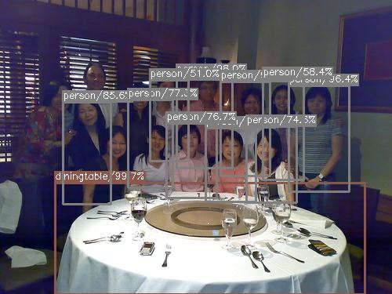
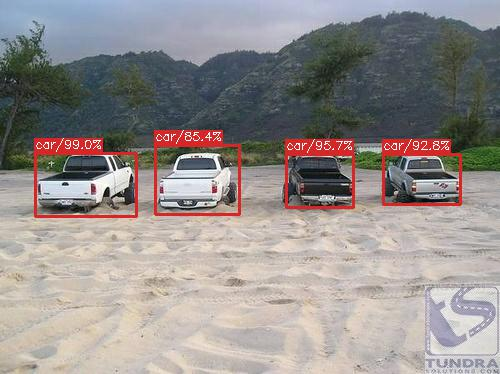
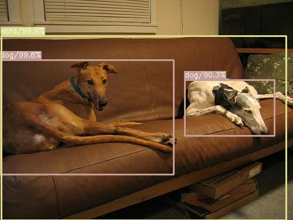

# X-Detector
X-Detector is a collection of several object detection algorithms. And some of those have not appeared in any academic papers.

Up to now, this repository contains code of the re-implementent of [Light-Head R-CNN](https://arxiv.org/abs/1711.07264) and this trained version had got to 74.85%mAP(77.29%mAP using VOC12 evaluation alogorithm), more improvement is still in process. You can download the latest model weights (trained on PASCAL-07+12) from [GoogleDrive](https://drive.google.com/open?id=1hOvHnvl4hY6A1hawI3cTxpXY6GcPENMG).

Below is the training timeline of Light-Head RCNN for single 480x480 input image.

Besides, several other detectors(named "X-Det") are also included, the main idea behind "X-Det" is to introduce explicit attention mechanisms between feature map channels. But the current performance of them is only ~0.71mAP on PASCAL-VOC 2007 Test Dataset, more improvement may need to introduce FPN-like structure on the top feature map(I didn't try this which is beyond the initial purpose of "X-Det").

The pre-trained weights of backbone network can be found in [Resnet-50 backbone](https://github.com/tensorflow/models/tree/master/official/resnet) and [Xception backbone](https://github.com/HiKapok/Xception_Tensorflow). The latest version of PsRoIAlign is [here](https://github.com/HiKapok/PSROIAlign).

You can use part of these codes for your research purpose, without any permission but following [Apache License 2.0](https://github.com/HiKapok/X-Detector/blob/master/LICENSE). All codes were tested under TensorFlow 1.6, Python 3.5, Ubuntu 16.04.

Here are some demo result images of "X-Det"-V2, debugging is still in process to make better performance:

## ##

**Update:**

- More than 7x performance improvement for Light-Head RCNN.
- Fine-tunning modified resnet backbone for "X-Det".
- Reorganize the order of the preprocessing pipeline.
- Switch to sample-wise hard negtive mining.

## ##
Apache License 2.0
